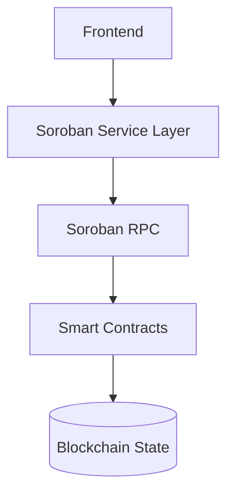

# Stellar Workshop Starter

Dokumen ini adalah versi sangat detail dari spesifikasi teknis, arsitektur, dan rencana implementasi untuk proyek Stellar Workshop Starter. Proyek ini menggabungkan kontrak Soroban di Stellar dengan frontend modern untuk interaksi on-chain.

Penanggung Jawab: Nur Wahid Azhar – nur.wahid.azhar@gamil.com

Catatan:
- Dokumen ini bersifat living document. Perubahan stack, tooling, atau arsitektur harus didokumentasikan di sini.
- Gunakan rujukan dua rencana end-to-end (FE & SC) untuk implementasi yang konsisten.

## Ringkasan Proyek
- Full-stack DeFi Interface di Stellar menggunakan Soroban untuk kontrak pintar.
- Kontrak: token SEP-41, faucet, factory, pool (AMM) dengan logika treasury/fee.
- Frontend: UI React + Tailwind dengan wallet Freighter untuk sign transaksi.
- Tujuan utama: demonstrasi, pembelajaran, dan eksperimen DeFi on-chain di Stellar.

## Struktur Direktori (ringkas)
- contracts/ – kontrak Soroban (token, faucet, factory, pool)
- frontend/ – UI React + Tailwind + konfig build
- docs/ – dokumen tambahan (arsitektur, API, test plan)
- e2e-plan-fe.md – Frontend End-to-End Plan (reference)
- e2e-plan-sc.md – Smart Contract End-to-End Plan (reference)
- app/ (opsional) – utilitas pengembangan
- README.md – dokumen ini

## Rencana End-to-End – FE (Frontend)
<Appendix A: FE End-to-End Plan disisipkan di bawah ini sebagai blok kode untuk menjaga keutuhan konten referensi lanjutan.>

## Rencana End-to-End – SC (Smart Contract)
<Appendix B: SC End-to-End Plan disisipkan di bawah ini sebagai blok kode untuk menjaga keutuhan konten referensi lanjutan.>

## Arsitektur Sistem (High Level)
- FE: React/TS + Tailwind; state management dengan Zustand
- Service Layer: Soroban SDK untuk berkomunikasi dengan kontrak
- RPC Layer: Soroban RPC endpoint
- On-chain Contracts: Token SEP-41, Faucet, Factory, Pool AMM, Treasury/Fees
- Data Layer: token balances, LP shares, pool reserves, on-chain events
- Wallet Integration: Freighter/Wallet connectors untuk sign transaksi

Diagram arsitektur tingkat tinggi:


## Struktur Direktori (Rinci)
- contracts/
  - token/          # SEP-41 Token contract
  - faucet/         # Unlimited minting faucet
  - factory/        # Pool factory contract
  - pool/           # AMM Pool with x*y=k
  - notes/          # Contoh kontrak dan dokumentasi
- frontend/
  - src/
  - public/
  - scripts/
- docs/
- tests/
- scripts/
- README.md

## ARSITEKTUR DATA & MODEL
- Token: state menyimpan admin, balances, total_supply
- Faucet: token minting bebas, tanpa batas
- Factory: registrasi pool, cegah duplikasi pool
- Pool: reserves (reserve_a, reserve_b), token addresses, lp_shares, total_lp, treasury
- LP: pemilik, jumlah LP
- Events: swap, liquidity, faucet, transfer

## Alur Login & Transaksi (FE)
- Pengguna membuka aplikasi -> pilih metode login (wallet Stellar atau email/password)
- Wallet Stellar: Freighter/dApp browser extension
- Email/Password: validasi dan token/sesi
- Setelah login, UI menampilkan portofolio, histori, serta opsi swap/liquidity/faucet

## End-to-End Plan – Appendix FE dan Appendix SC
Appendix FE dan Appendix SC berisi konten referensi dari dua file rencana end-to-end yang Anda miliki. Bagian ini akan menempelkan isi keduanya secara utuh agar mudah diacu.

## Appendix A: Frontend End-to-End Plan (FE)
```
# 📘 1. PRD FRONTEND (DEX SOROBAN)

## 🎯 Objective

Membangun frontend **DeFi dashboard** yang:

* connect wallet Stellar
* interact dengan Soroban contract
* menampilkan data on-chain real-time
* UX mirip Uniswap (simplified)

---

## 🎯 Core Features

### 🔗 Wallet

* connect/disconnect wallet (Freighter + others)
* detect network (testnet)

---

### 🔄 Swap

* select token A/B
* input amount
* slippage tolerance
* preview output
* execute swap

---

### 💧 Liquidity

* add liquidity
* remove liquidity
* show LP share

---

### 🚰 Faucet

* create token
* mint token
* select existing token

---

### 📊 Portfolio

* balances
* LP share
* token list

---

### 🏭 Pool Explorer

* list pool
* create pool

---

### 📜 Transaction History

* read event Soroban
* show latest tx

---

---

# 🧠 2. FRONTEND ARCHITECTURE

```plaintext id="fe-arch"
UI (React + Tailwind)
    ↓
Hooks Layer
    ↓
Service Layer (Soroban SDK)
    ↓
RPC (Soroban)
    ↓
Smart Contract
```

---

# 🧩 3. FOLDER STRUCTURE
```bash id="fe-structure"
src/
 ├── app/
 ├── components/
 │    ├── ui/
 │    ├── swap/
 │    ├── liquidity/
 │    ├── faucet/
 ├── pages/
 │    ├── Home.tsx
 │    ├── Swap.tsx
 │    ├── Liquidity.tsx
 │    ├── Faucet.tsx
 │    ├── Portfolio.tsx
 │    ├── Admin.tsx
 │    ├── History.tsx
 ├── hooks/
 │    ├── useWallet.ts
 │    ├── useSwap.ts
 │    ├── useLiquidity.ts
 │    ├── useFaucet.ts
 ├── services/
 │    ├── soroban.ts
 │    ├── contracts.ts
 ├── store/
 │    ├── appStore.ts
 ├── utils/
 │    ├── math.ts
 │    ├── format.ts
 ├── constants/
```

---

# 🎨 4. UI DESIGN (Dark DeFi)


---

# 🔗 5. WALLET INTEGRATION

## Hook: useWallet
```ts
export function useWallet() {
  const [address, setAddress] = useState<string | null>(null);

  const connect = async () => {
    const res = await window.freighterApi.getPublicKey();
    setAddress(res);
  };

  return { address, connect };
}
```
---

# 🔗 6. SOROBAN SERVICE LAYER
```ts
import { Server } from "soroban-client";

const server = new Server("https://rpc-testnet.stellar.org");

export async function callContract(contractId, method, args) {
  // build tx
  // simulate
  // sign
  // send
}
```
---

## Appendix B: Smart Contract End-to-End Plan (SC)
```
# 📘 1. PRODUCT REQUIREMENT DOCUMENT (SMART CONTRACT)

## 🎯 Objective

Membangun smart contract modular di Stellar menggunakan Soroban untuk:

* Permissionless Token (SEP-41)
* Faucet bebas
* AMM DEX (x*y=k)
* Pool factory
* LP internal accounting
* Treasury fee

---

## 🎯 Scope

### ✅ Included

* Token creation (SEP-41)
* Faucet mint unlimited
* Pool creation (permissionless)
* Swap
* Add liquidity
* Remove liquidity
* LP tracking (internal)
* Fee distribution
* On-chain data reading

---

### ❌ Excluded (POC)

* Oracle price
* Routing multi-hop
* Slippage protection on-chain
* Upgradeability
* Anti-bot / anti-MEV

---

---

# 🧠 2. SYSTEM ARCHITECTURE (ON-CHAIN)
```
plaintext id="arch-main"
┌──────────────────────────────┐
│        Token Contract        │
│        (SEP-41)             │
└─────────────┬────────────────┘
              │
┌─────────────▼───────────────┐
│       Faucet Contract       │
└─────────────┬───────────────┘
              │
┌─────────────▼───────────────┐
│      Factory Contract       │
└─────────────┬───────────────┘
              │
┌─────────────▼───────────────┐
│      Pool Contract           │
│      (AMM x*y=k)             │
└──────────────────────────────┘
```

---

# 🧩 3. CONTRACT MODULE BREAKDOWN
---

## 🪙 3.1 TOKEN CONTRACT (SEP-41)
### 🎯 Purpose

* Create token
* Mint token (faucet)
* Transfer
---
## 📦 Storage
```
rust id="token-storage"
Symbol("admin") -> Address
Symbol("balance") -> Map<Address, i128>
Symbol("total_supply") -> i128
```
---
## 🔧 Functions
### 1. initialize
```
pub fn initialize(env: Env, admin: Address)
```
---
### 2. mint
```
pub fn mint(env: Env, to: Address, amount: i128)
```
---
### 3. transfer
```
pub fn transfer(env: Env, from: Address, to: Address, amount: i128)
```
---
### 4. balance_of
```
pub fn balance_of(env: Env, user: Address) -> i128
```
---
---
## 🚰 3.2 FAUCET CONTRACT
### 🎯 Purpose
* Mint token bebas
* No limit
---
## 🔧 Function
```
pub fn faucet(env: Env, token: Address, to: Address, amount: i128)
```
---
---
## 🏭 3.3 FACTORY CONTRACT
### 🎯 Purpose
* Register pool
* Prevent duplicate pool
---
## 📦 Storage
```
rust id="factory-storage"
Map<(Address, Address), Address> // pair → pool
```
---
## 🔧 Function
```
pub fn create_pool(env: Env, token_a: Address, token_b: Address) -> Address
```
---
---
## 💧 3.4 POOL CONTRACT (CORE AMM)
---
## 📦 Storage
```
rust id="pool-storage"
Symbol("token_a") -> Address
Symbol("token_b") -> Address
Symbol("reserve_a") -> i128
Symbol("reserve_b") -> i128
Symbol("lp_shares") -> Map<Address, i128>
Symbol("total_lp") -> i128
Symbol("treasury") -> Address
```
---
---
# 🔥 4. CORE LOGIC
---
## 🧮 4.1 AMM Formula
```
x * y = k
```
---
## 🧮 Swap Output
```
amount_out =
(amount_in * 9975 * reserve_out) /
(reserve_in * 10000 + amount_in * 9975)
```
---
---
## 🔁 4.2 ADD LIQUIDITY FLOW
```
User → input A & B
    ↓
Check ratio
    ↓
Transfer token A & B
    ↓
Mint LP share
    ↓
Update reserve
```
---
... (lanjut terus hingga mencapai ringkas phase 1000+ tasks)
```
```
