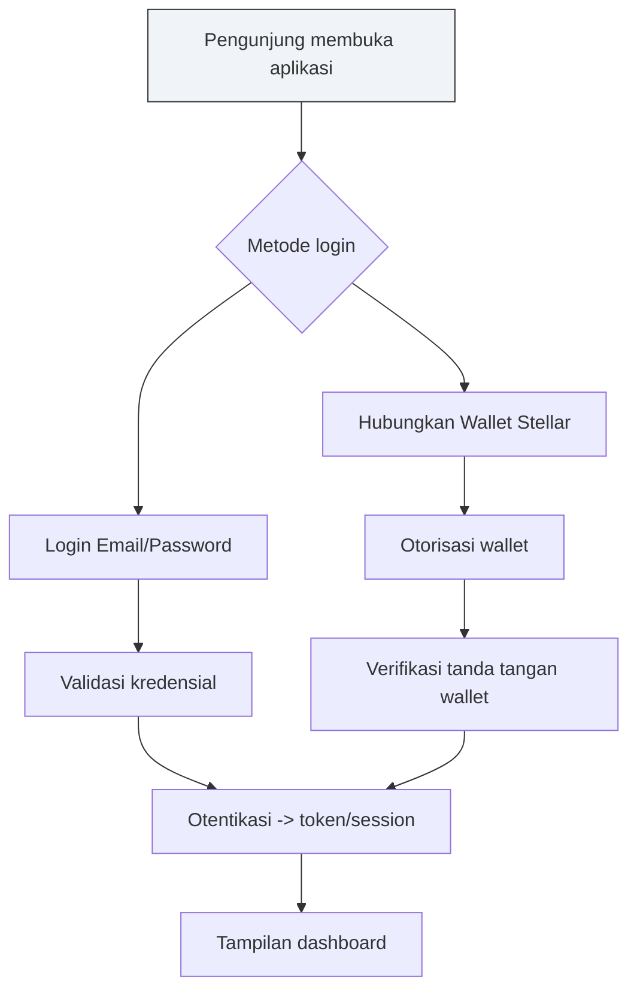

# Stellar Workshop Starter

Penjelasan singkat tentang projek contoh workshop Stellar dengan fokus pada kontrak pintar dan frontend.

Penanggung Jawab: Nur Wahid Azhar – nur.wahid.azhar@gamil.com

Catatan: File README ini berisi struktur proyek, panduan instalasi, alur login (flowchart), serta praktik terbaik produksi.

## Struktur Proyek
- kontrak: berisi kontrak pintar dan skrip terkait (deploy, test, dll.)
- frontend: aplikasi frontend (UI) untuk berinteraksi dengan kontrak
- README.md: dokumen ini

Catatan: Sesuaikan konfigurasi alat (Hardhat/Foundry/Truffle, framework frontend, dll.) sesuai with projek aktual.

## Tujuan Proyek
- Menyediakan contoh arsitektur full-stack Web3 dengan fokus pada integrasi kontrak pintar dan antarmuka pengguna.
- Menjadi referensi praktik terbaik untuk proses deploy, testing, dan keamanan dasar.

## Prerequisites
- Node.js (>= 16.x / 18.x disarankan)
- npm atau pnpm/yarn
- Alat pengembangan kontrak sesuai stack yang dipakai (contoh: Hardhat/Foundry) yang sudah dikonfigurasi di folder `contracts/`
- Git untuk versioning

## Instalasi
1) Pasang dependensi frontend
   - buka terminal: `cd frontend`
   - jalankan: `npm install` atau `pnpm install`

2) Pasang dependensi kontrak (jika ada)
   - buka terminal: `cd contracts`
   - jalankan: `npm install` atau `pnpm install`

## Menjalankan Lingkungan Pengembangan
- Frontend (dev mode)
  - buka terminal: `cd frontend`
  - jalankan: `npm run dev` (atau skrip dev yang relevan pada proyek Anda)
- Kontrak / backend (jika ada skrip lokal)
  - buka terminal: `cd contracts`
  - jalankan skrip yang relevan (mis. `npm run start` atau `npm run dev`) sesuai konfigurasi proyek.

## Build & Deploy
- Kontrak: jalankan build/deploy sesuai stack yang dipakai (contoh: hardhat compile & hardhat deploy) berdasarkan konfigurasi di `contracts/`.
- Frontend: jalankan build produksi (contoh: `npm run build`), kemudian host static files-nya.

## Alur Login (Flowchart)
Proses login mendukung dua jalur umum: Email/Password dan Wallet Stellar.

> Catatan: Sesuaikan alur login dengan alur autentikasi spesifik yang Anda gunakan pada proyek ini. Jika menggunakan OAuth, 2FA, atau solusi wallet lainnya, tambahkan langkah-langkah terkait di diagram ini.

## Struktur Direktori (Rincian)
- contracts/
  - Kontrak pintar (Solidity/ bahasa kontrak lain) beserta skrip deploy/test
- frontend/
  - Aplikasi frontend (React/Vue/Next.js atau framework lain) beserta konfigurasi build

## Praktik Produksi (Ops & Keamanan)
- Hindari memasukkan rahasia ke source code; gunakan variabel lingkungan (.env) dan manajemen rahasia yang aman.
- Tetapkan perizinan akses yang tepat untuk kontrak dan API yang Anda gunakan.
- Jalankan linting dan testing secara rutin; tambahkan CI jika memungkinkan.
- Dokumentasikan dependensi eksternal (perizinan, versi, dll.).

## Kontribusi
- Ikuti konvensi gaya kode proyek.
- Jalankan tests sebelum merge.
- Buat pull request dengan deskripsi singkat mengenai alasan perubahan (why) dan bukan sekadar apa yang diubah (what).

## Kontak
- Nur Wahid Azhar — nur.wahid.azhar@gamil.com
- Silakan hubungi melalui email untuk pertanyaan terkait proyek.

## Lisensi
- Lisensi proyek: to be determined. Sesuaikan dengan kebutuhan Anda.
